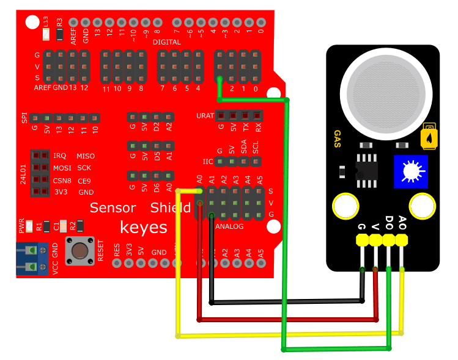
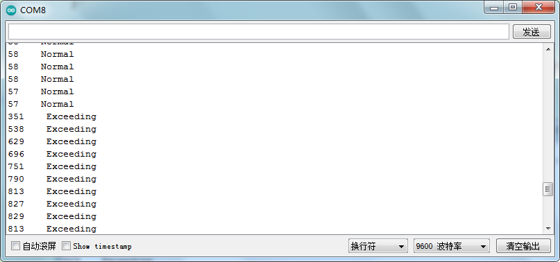

# Arduino


## 1. Arduino简介  

Arduino是一个开源电子原型平台，旨在简化硬件开发和程序编写。Arduino系统包含硬件和软件两个部分，硬件包括多个型号的控制板，而软件则是Arduino IDE，用于编写、上传和调试程序。Arduino具有用户友好的接口，广泛用于电子项目和物联网设备的开发。它支持多种编程语言，主要是C和C++，并有大量的库可供使用，使得即使是初学者也能够快速上手并创建各种项目，如智能家居、机器人、环境监测等。Arduino的社区活跃，资源丰富，提供了大量的教程和项目示例，促进了学习和创新。  

## 2. 连接图  

  

## 3. 测试代码  

```cpp  
int digitalPin = 3;  
int analogPin = A0;  

// 以下两个变量分别存放数字信号与模拟信号  
int analogVal = 0;  
int digitalVal = 0;  

void setup() {  
    Serial.begin(9600); // 设置波特率为9600  
    pinMode(digitalPin, INPUT); // 数字引脚3设置为输入模式  
    pinMode(analogPin, INPUT); // 模拟引脚A0设置为输入模式  
}  

void loop() {  
    analogVal = analogRead(analogPin); // 读取模拟信号  
    digitalVal = digitalRead(digitalPin); // 读取数字信号  
    Serial.print(analogVal);  
    if (digitalVal == 1) {  
        Serial.println(" Normal");  
    } else {  
        Serial.println(" Exceeding");  
    }  
    delay(100); // 延时100毫秒  
}  
```  

## 4. 测试结果  

按照上图接线，烧录好程序，上电后，传感器上D1灯亮起，调节电位器可调节灵敏度；打开窗口监视器，可看到相对应的模拟值，如下图所示。  




