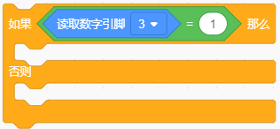
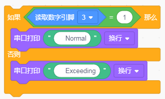
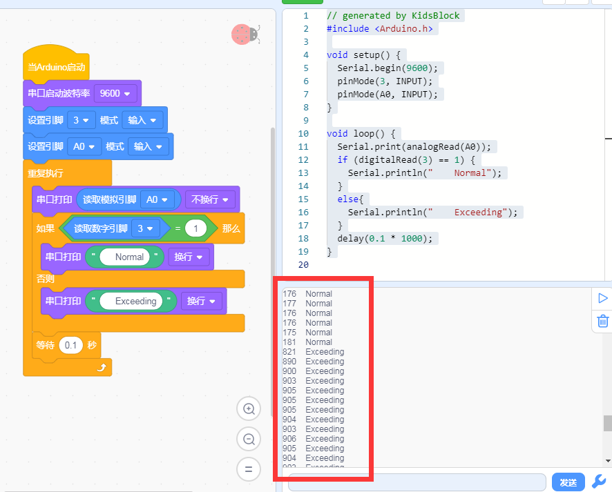

# KidsBlock

## 1. KidsBlock简介  

KidsBlock是一款图形化编程工具，旨在为儿童和初学者提供一个简单、有趣的编程体验。通过积木式的拖放接口，用户可以轻松地创建程序，而无需编写传统代码。KidsBlock支持与Arduino及其他硬件平台的集成，使得学生能够进行各种电子项目的开发，如机器人、传感器应用等。这款工具提供了丰富的功能模块和示例程序，能够有效提升学习者的创造力和编程技能，适合教育和自我学习的场景。  

## 2. 连接图  

  

## 3. 测试代码  

1. 在事件栏拖出Arduino启动模块，然后在串口栏拖出串口启动波特率模块并设置为9600。  

     

2. 在引脚栏拖出两个设置引脚模式模块，一个设置为引脚3输入；另一个设置为引脚A0输入。  

     

3. 在控制栏拖出重复执行模块。  

     

4. 在串口栏拖出打印模块，然后在引脚栏拖出读取模拟引脚模块设置引脚为A0，放在打印模块的格子里，并设置串口打印不换行。  

     

5. 在控制栏拖出判断模块，然后在判断模块里添加运算的等于模块，等于模块的左边添加读取数字引脚3模块，右边为0。  

     

6. 在串口栏拖出串口打印模块然后添加文本栏拖出文本模块设置文本为“Normal”。  

7. 在串口栏拖出串口打印模块然后添加文本栏拖出文本模块设置文本为“Exceeding”。  

8. 把串口打印代码块添加在判断模块中。  

     

9. 在控制栏拖出延时模块并设置延时为100ms。  

     

## 4. 测试结果  

按照上图接线，烧录好程序，上电后，传感器上D1灯亮起，调节电位器可调节灵敏度；打开窗口监视器，可看到相对应的模拟值，如下图所示。  

