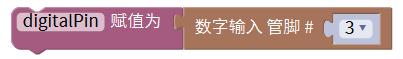
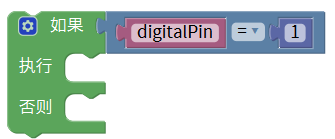
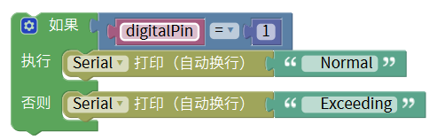
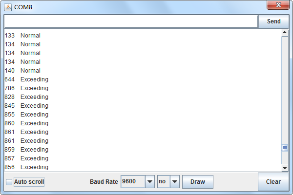

# Mixly

## 1. Mixly简介  

Mixly是一款专为初学者和儿童设计的图形化编程工具。它以积木式的界面让用户能够方便地拖拽各种功能模块，从而构建自己的程序，而无需学习复杂的编程语言。Mixly支持多个硬件平台，特别是Arduino，适用于教育和个人项目。通过多种编程语言的支持，如C语言、Scratch和Mixly图形化编程，用户可以体验到编程的乐趣，并能轻松开展各种电子和机器人项目。Mixly致力于启发青少年和初学者的创造力，使编程变得更加直观和有趣。  

## 2. 连接图  

  

## 3. 测试代码  

1. 在变量栏拖声明变量模块并设置变量名为digitalPin，赋值为0。  

     

2. 在变量栏拖出变量digitalPin赋值模块，并赋值数字引脚3的值。  

     

3. 在串口栏拖出打印模块，并添加打印值为模拟引脚A0。  

     

4. 在控制栏拖出判断模块。  

     

5. 在判断模块如果后面添加逻辑栏里的等于模块，然后在等于模块里添加变量栏里的digitalPin变量模块等于数字栏里的数字模块，并设置数字为0。  

     

6. 在串口栏拖出串口打印（自动换行）模块并添加文本栏里的文本模块，设置文本为“Normal”；同样的操作设置文本为“Exceeding”，并分别添加在执行中。  

     

7. 在控制栏拖出延时模块并设置延时为100ms。  

     

## 4. 测试结果  

按照上图接线，烧录好程序，上电后，传感器上D1灯亮起，调节电位器可调节灵敏度；打开窗口监视器，可看到相对应的模拟值，如下图所示。  

