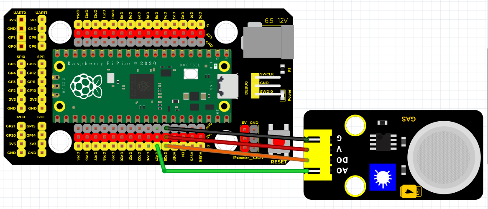
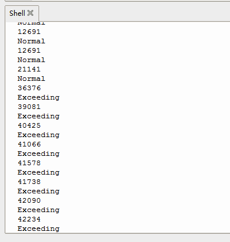

# Python


## 1. Python简介  

Python是一种高级编程语言，以其清晰的语法和明确的结构而受到广泛欢迎。自1991年发布以来，Python已成为数据科学、机器学习、Web开发和自动化等领域的热门选择。Python支持多种编程范式，包括面向对象、函数式和命令式编程，使其适合不同类型的开发者。Python的丰富库和框架（如NumPy、Pandas、Flask等）大大简化了项目开发过程。其简单易学的特性使其成为初学者和教育领域中最常用的语言之一。  

## 2. 连接图  

  

## 3. 测试代码  

```python  
import machine  
import utime  

digitalPin = machine.Pin(28, machine.Pin.IN)  # 设置28脚为数字信号  
analogPin = machine.ADC(27)  # 设置27脚为模拟信号  

while True:  
    reading = analogPin.read_u16()  # 读取模拟信号  
    print(reading)  # 打印模拟值  
    if digitalPin.value() == 1:  # 判断数字信号是否为1  
        print("Normal")  
    else:  
        print("Exceeding")  
    utime.sleep_ms(100)  # 延时100毫秒  
```  

## 4. 测试结果  

按照上图接线，烧录好程序，上电后，传感器上D1灯亮起，调节电位器可调节灵敏度；打开窗口监视器，可看到相对应的模拟值，如下图所示。  




